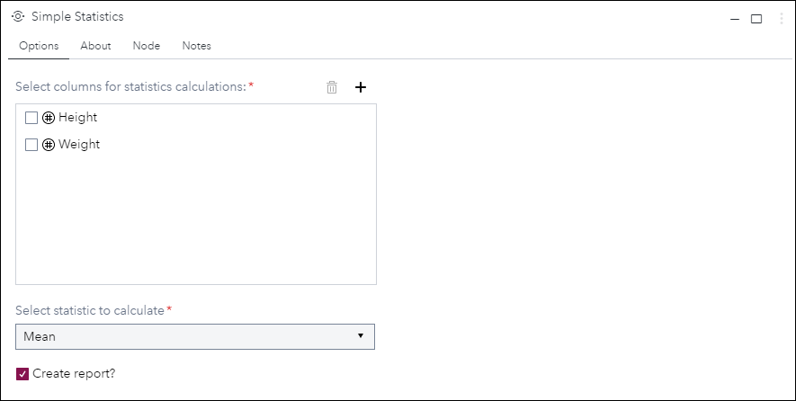
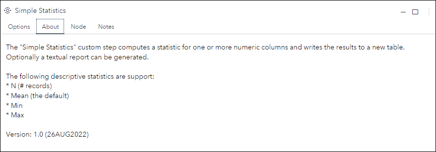
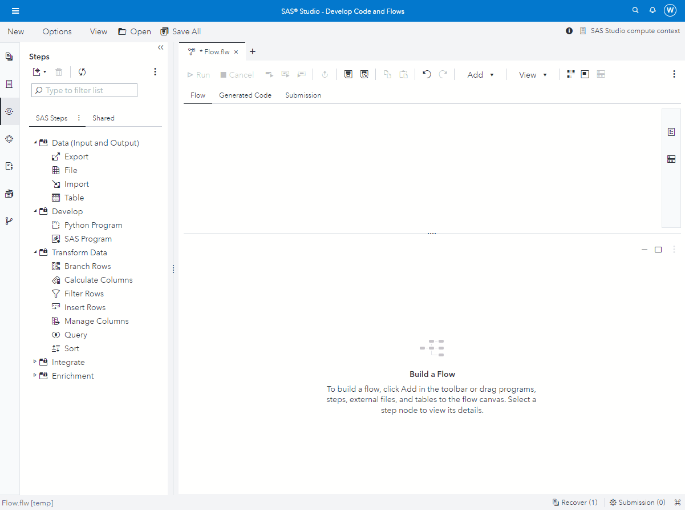

# Simple Statistics

## Description

The **Simple Statistics** custom step computes a simple descriptive statistic for one or more numeric columns in a table and writes the results to a new table.

One of the following descriptive statistics can be selected:
 * N (number of observations)
 * MEAN (selected by default)
 * MIN
 * MAX
 
More details can be found in [SAS Viya Programming Documentation - MEANS Procedure](https://documentation.sas.com/?cdcId=pgmsascdc&cdcVersion=default&docsetId=proc&docsetTarget=p0f0fjpjeuco4gn1ri963f683mi4.htm)

## User Interface

* ### Rank Options tab ###

   | Standalone mode | Flow mode |
   | --- | --- |                  
   |  |  |

* ### About tab ###

   

## Requirements

No special requirements. 
  * The custom step uses UI controls that have been available for quite a while
  * The custom step code generator uses proc means, which should be available in all SAS Viya deployments

## Usage

## Change Log

* Version 1 (26AUG2022)
    * Initial version

DUMMY LINE ADDED
